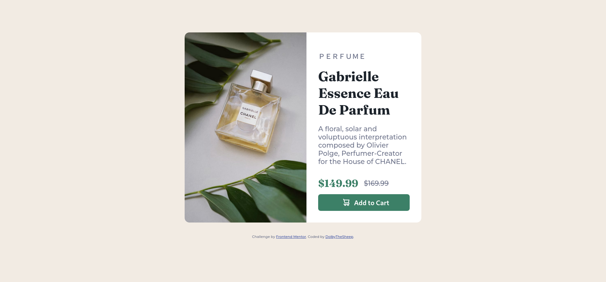
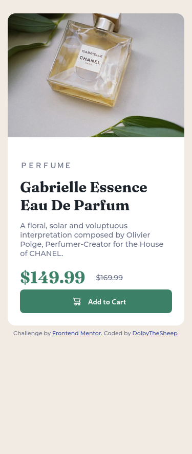

# Frontend Mentor - Product preview card component solution

This is a solution to the [Product preview card component challenge on Frontend Mentor](https://www.frontendmentor.io/challenges/product-preview-card-component-GO7UmttRfa). Frontend Mentor challenges help you improve your coding skills by building realistic projects. 

## Table of contents

- [Overview](#overview)
  - [The challenge](#the-challenge)
  - [Screenshot](#screenshot)
  - [Links](#links)
- [My process](#my-process)
  - [Built with](#built-with)
  - [What I learned](#what-i-learned)

## Overview

### The challenge

Users should be able to:

- View the optimal layout depending on their device's screen size
- See hover and focus states for interactive elements

### Screenshot


|Desktop                                           | Mobile                                         |
|--------------------------------------------------|------------------------------------------------|
|||


### Links

- Solution URL: [https://github.com/DolbyTheSheep/Product-preview-card.git](https://github.com/DolbyTheSheep/Product-preview-card.git)
- Live Site URL: [https://dolbythesheep.github.io/Product-preview-card/](https://dolbythesheep.github.io/Product-preview-card/)

## My process

### Built with

- Semantic HTML5 markup
- CSS custom properties
- Flexbox
- CSS Grid
- Mobile-first workflow

### What I learned

For this challenge I started with the mobile version, adding a query to check the screen size for bigger screens.

```css
@media screen and (min-width: 768px)
```

Using the `picture` tag I was able to include different sizes of the same photo,.

```html
<picture>
      <source media="(min-width:768px)" srcset="./images/image-product-desktop.jpg">
      
</picture>
```

Using variables for repetitive values was a better code design choice.

```css
:root {
    --white-color: hsl(0, 0%, 100%);
    --cream-color: hsl(30, 38%, 92%);
    --dark-cian-color: hsl(158, 36%, 37%);
    --very-dark-blue-color: hsl(212, 21%, 14%);
    --dark-grayish-blue-color: hsl(228, 12%, 48%);
}
```

The variable was used in this way:

```css
background-color: var(--white-color);
```

I learned to use `calc` to render a responsive size for the font, depending on the screen view.

```css
   font-size: calc([minimum size] + 
        ([maximum size] - [minimum size]) * 
        ((100vw - [minimum viewport width]) / 
        ([maximum viewport width] - [minimum viewport width])));
```
